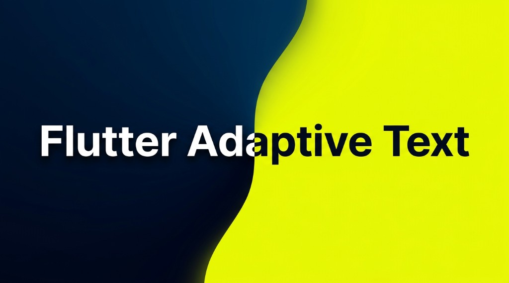
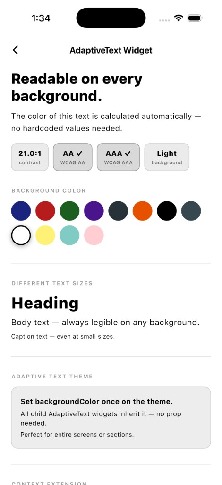
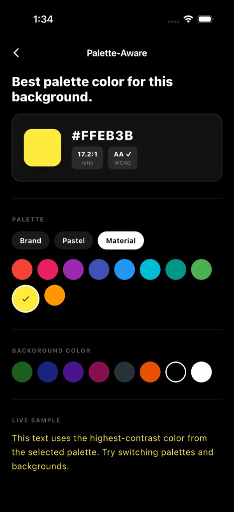
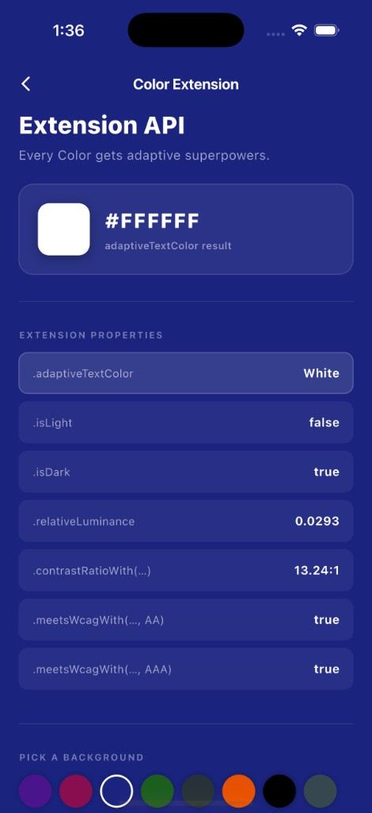
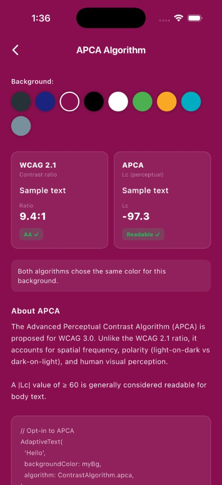

# flutter_adaptive_text

[](https://pub.dev/packages/flutter_adaptive_text)
[](https://github.com/iuzairaslam/flutter_adaptive_text/blob/main/LICENSE)
[](https://pub.dev/packages/flutter_lints)
[](https://flutter.dev)



Ever put text on a colored card and realize it’s **hard to read**, or you keep flipping between white and black by hand? **flutter_adaptive_text** does that thinking for you.

You give it the **background color** (and optionally a small list of **brand colors**). It picks a **text color** that stays readable, usually black or white, or whichever brand color scores best. Under the hood it uses the same kind of **contrast math** accessibility guidelines rely on (so you’re not guessing from gut feel alone).

You don’t need to be an accessibility expert to use it. If you *are* working toward stricter checks or newer contrast models, the package still has you covered with optional modes and helpers.


## Why people reach for it

* **Fewer “oops, can’t read that” moments** on banners, buttons, chips, and colored headers.
* **Brand friendly:** you’re not locked to only black and white; you can pass your real palette and let the best option win.
* **Keeps Flutter simple:** one import, no extra runtime packages, just the Flutter SDK.
* **Icons and custom widgets too**, not only paragraphs of text, so the whole tile can match.


## Try the demo (see it on screen)

If you already use Flutter, open a terminal in this repo’s **`example`** folder and run:

```bash
cd example
flutter pub get
flutter run
```

You’ll get a small sample app that walks through the main ideas; no need to wire anything up first.

<table>
  <tr>
    <th align="center">AdaptiveText widget</th>
    <th align="center">Palette aware</th>
    <th align="center">Color extension API</th>
    <th align="center">APCA algorithm</th>
  </tr>
  <tr>
    <td align="center" valign="top"></td>
    <td align="center" valign="top"></td>
    <td align="center" valign="top"></td>
    <td align="center" valign="top"></td>
  </tr>
</table>


## Use it in your own app

**1.** Add the package in your app’s dependency list (the `pubspec` file in your project root):

```yaml
dependencies:
  flutter_adaptive_text: ^1.0.0
```

**2.** Run `flutter pub get`.

**3.** Import once:

```dart
import 'package:flutter_adaptive_text/flutter_adaptive_text.dart';
```

**4.** Swap a line of text for something that “knows” the background:

```dart
AdaptiveText(
  'Hello',
  backgroundColor: Colors.indigo.shade900,
)
```

That’s the happy path: the package chooses a foreground that tends to read well on that background.

**Optional: your brand colors instead of only black/white**

```dart
AdaptiveText(
  'Sale ends today',
  backgroundColor: brandSurface,
  palette: const [Color(0xFFFF6B00), Color(0xFF1E3A5F), Colors.white],
)
```

**Optional: set the background once for a whole section** (titles, subtitles, and so on pick it up automatically)

```dart
AdaptiveTextTheme(
  backgroundColor: cardColor,
  child: const Column(
    children: [
      AdaptiveText('Title'),
      AdaptiveText('Subtitle'),
    ],
  ),
)
```

You need **Flutter 3.10+** and **Dart 3.0+**.


## A note for designers and product folks

This package answers: **“What color should the letters be so people can actually read them?”**  
It does **not** replace a full design system, pick gradients for you, or read colors out of a photo. It works with **solid colors** you already chose for UI surfaces.


## Want the full technical map?

Names like **WCAG**, **APCA**, contrast ratios, and every function signature live in the **official API docs** (best for developers and copy/paste reference):

[pub.dev documentation for flutter_adaptive_text](https://pub.dev/documentation/flutter_adaptive_text/latest/)


## License & source

MIT. See [LICENSE](https://github.com/iuzairaslam/flutter_adaptive_text/blob/main/LICENSE).

Repository: [github.com/iuzairaslam/flutter_adaptive_text](https://github.com/iuzairaslam/flutter_adaptive_text)
